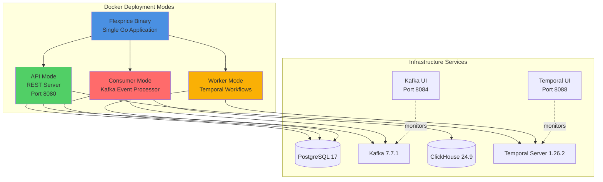
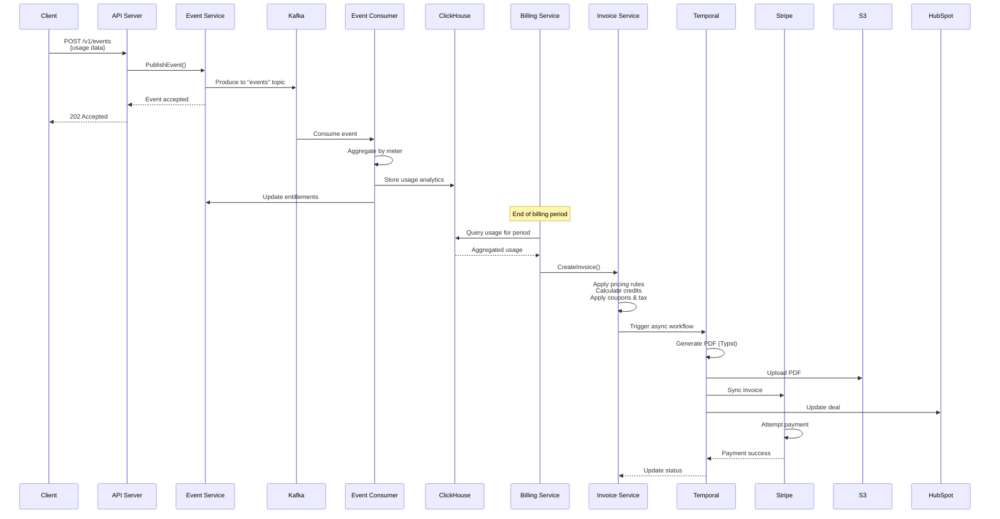

# Flexprice Architecture Diagram

## High-Level System Architecture

```mermaid
graph TB
    subgraph "Client Layer"
        SDK[JavaScript/Node SDK]
        REST[REST API Clients]
        WH[Webhook Consumers]
        DASH[Customer Dashboard]
    end

    subgraph "API Gateway Layer"
        GIN[Gin HTTP Server<br/>Port 8080<br/>37 REST Endpoints]
        AUTH[Authentication<br/>API Key / JWT]
    end

    subgraph "Service Layer - Core Business Logic"
        subgraph "Metering & Events"
            EVT_SVC[Event Service]
            METER_SVC[Meter Service]
            FEAT_SVC[Feature Service]
        end

        subgraph "Billing & Revenue"
            BILL_SVC[Billing Service]
            INV_SVC[Invoice Service]
            SUB_SVC[Subscription Service]
            PRICE_SVC[Price Service]
        end

        subgraph "Credits & Payments"
            PAY_SVC[Payment Service]
            WALLET_SVC[Wallet Service]
            CREDIT_SVC[Credit Grant Service]
        end

        subgraph "Customer Management"
            CUST_SVC[Customer Service]
            ENT_SVC[Entitlement Service]
            PLAN_SVC[Plan Service]
        end

        subgraph "Promotions & Tax"
            COUPON_SVC[Coupon Service]
            TAX_SVC[Tax Service]
            ADDON_SVC[Addon Service]
        end
    end

    subgraph "Repository Layer - Data Access"
        REPO[30+ Domain Repositories<br/>Event, Invoice, Customer,<br/>Subscription, Payment, etc.]
    end

    subgraph "Data Layer"
        PG[(PostgreSQL<br/>Ent ORM<br/>Transactional Data)]
        CH[(ClickHouse<br/>Time-Series<br/>Analytics)]
        KAFKA[Kafka Event Stream<br/>Usage Events]
        S3[(AWS S3<br/>PDF Storage)]
    end

    subgraph "Async Processing"
        TEMPORAL[Temporal Workflows<br/>Invoice Sync<br/>Price Sync<br/>Export Jobs]

        subgraph "Kafka Consumers"
            CONSUMER1[Event Processing<br/>Consumer]
            CONSUMER2[Feature Tracking<br/>Consumer]
            CONSUMER3[Post-Processing<br/>Consumer]
        end
    end

    subgraph "External Integrations"
        STRIPE[Stripe<br/>Payment Processor]
        RAZORPAY[Razorpay<br/>Payment Processor]
        HUBSPOT[HubSpot<br/>CRM Sync]
        RESEND[Resend<br/>Email Service]
        SVIX[Svix<br/>Webhook Delivery]
    end

    subgraph "Observability"
        SENTRY[Sentry<br/>Error Tracking]
        PYRO[Grafana Pyroscope<br/>Performance Monitoring]
    end

    subgraph "Document Generation"
        TYPST[Typst PDF Generator<br/>Invoice Templates]
    end

    %% Client to API
    SDK --> GIN
    REST --> GIN
    WH -.-> |receives| SVIX
    DASH --> GIN

    %% API Gateway
    GIN --> AUTH
    AUTH --> EVT_SVC
    AUTH --> BILL_SVC
    AUTH --> CUST_SVC
    AUTH --> PAY_SVC
    AUTH --> COUPON_SVC

    %% Service Layer Connections
    EVT_SVC --> KAFKA
    EVT_SVC --> METER_SVC
    METER_SVC --> FEAT_SVC

    BILL_SVC --> INV_SVC
    BILL_SVC --> SUB_SVC
    BILL_SVC --> PRICE_SVC

    INV_SVC --> PAY_SVC
    INV_SVC --> TAX_SVC
    INV_SVC --> COUPON_SVC
    INV_SVC --> TYPST

    SUB_SVC --> PLAN_SVC
    SUB_SVC --> ENT_SVC

    PAY_SVC --> WALLET_SVC
    WALLET_SVC --> CREDIT_SVC

    %% Service to Repository
    EVT_SVC --> REPO
    BILL_SVC --> REPO
    CUST_SVC --> REPO
    PAY_SVC --> REPO
    SUB_SVC --> REPO
    PLAN_SVC --> REPO
    FEAT_SVC --> REPO
    ENT_SVC --> REPO
    COUPON_SVC --> REPO

    %% Repository to Data Layer
    REPO --> PG
    REPO --> CH

    %% Kafka Event Processing
    KAFKA --> CONSUMER1
    KAFKA --> CONSUMER2
    KAFKA --> CONSUMER3

    CONSUMER1 --> PG
    CONSUMER1 --> CH
    CONSUMER2 --> ENT_SVC
    CONSUMER3 --> REPO

    %% Temporal Workflows
    INV_SVC --> TEMPORAL
    BILL_SVC --> TEMPORAL
    TEMPORAL --> HUBSPOT
    TEMPORAL --> S3

    %% Document Generation
    TYPST --> S3

    %% External Integrations
    PAY_SVC --> STRIPE
    PAY_SVC --> RAZORPAY
    INV_SVC --> STRIPE
    TEMPORAL --> HUBSPOT
    BILL_SVC --> RESEND
    EVT_SVC --> SVIX

    %% Observability
    GIN -.-> SENTRY
    GIN -.-> PYRO
    REPO -.-> SENTRY

    style GIN fill:#4A90E2
    style KAFKA fill:#FF6B6B
    style PG fill:#336791
    style CH fill:#FFCC00
    style TEMPORAL fill:#00D9FF
    style STRIPE fill:#635BFF
    style HUBSPOT fill:#FF7A59
```

## Component Descriptions

### Client Layer
- **JavaScript/Node SDK**: Auto-generated client library from OpenAPI specs
- **REST API Clients**: Direct HTTP integration with API
- **Webhook Consumers**: Receive event notifications via Svix
- **Customer Dashboard**: Self-service portal for end customers

### API Gateway Layer
- **Gin HTTP Server**: High-performance Go web framework serving 37 REST endpoints
- **Authentication**: API key and JWT-based authentication middleware

### Service Layer
**43 Domain Entities** managed across 25+ services grouped by domain:
- **Metering**: Event ingestion, meter definitions, usage tracking
- **Billing**: Invoice generation, subscription lifecycle, pricing rules
- **Payments**: Payment processing, wallet/credits, payment retries
- **Customer Management**: Customer data, entitlements, plan associations
- **Promotions**: Coupons, add-ons, tax calculations

### Repository Layer
- **30+ Repository Classes**: Data access abstraction for all domain entities
- **Pattern**: One repository per entity with CRUD + custom query methods

### Data Layer
- **PostgreSQL**: Primary transactional database (Ent ORM for type-safe queries)
- **ClickHouse**: Time-series analytics for usage event aggregation
- **Kafka**: Event streaming backbone for async event processing
- **AWS S3**: Document storage for invoice PDFs

### Async Processing
- **Temporal Workflows**: Long-running async processes (invoice sync, exports)
- **Kafka Consumers**: Three specialized consumers for event processing:
  - Event aggregation and storage
  - Real-time feature usage tracking
  - Post-processing and reconciliation

### External Integrations
- **Stripe/Razorpay**: Payment processing and subscription management
- **HubSpot**: CRM integration for invoice and deal synchronization
- **Resend**: Transactional email delivery
- **Svix**: Reliable webhook delivery to customers

### Supporting Services
- **Typst**: Modern document compiler for PDF invoice generation
- **Sentry**: Error tracking and performance monitoring
- **Grafana Pyroscope**: Continuous profiling for performance optimization

## Deployment Architecture

## Data Flow: Usage-Based Billing

## Technology Stack Summary

| Layer | Technology | Purpose |
|-------|-----------|---------|
| **Language** | Go 1.23.0 | Backend application |
| **Web Framework** | Gin | HTTP routing and middleware |
| **ORM** | Ent | Type-safe database queries |
| **Primary DB** | PostgreSQL 17 | Transactional data |
| **Analytics DB** | ClickHouse 24.9 | Time-series usage data |
| **Event Streaming** | Kafka 7.7.1 | Async event processing |
| **Workflow Engine** | Temporal 1.26.2 | Long-running workflows |
| **Payment** | Stripe, Razorpay | Payment processing |
| **CRM** | HubSpot | Sales integration |
| **Document Gen** | Typst | PDF invoice generation |
| **Webhooks** | Svix | Webhook delivery |
| **Email** | Resend | Transactional emails |
| **Monitoring** | Sentry, Pyroscope | Error tracking & profiling |
| **Storage** | AWS S3 | Document storage |
| **Container** | Docker, Docker Compose | Deployment |

## Key Architectural Patterns

1. **Layered Architecture**: API → Service → Repository → Database
2. **Event-Driven**: Kafka-based async event processing
3. **CQRS**: Separate write (PostgreSQL) and read (ClickHouse) models
4. **Repository Pattern**: Data access abstraction
5. **Dependency Injection**: Uber Fx for IoC
6. **Multi-tenancy**: Tenant isolation across all entities
7. **Workflow Orchestration**: Temporal for complex async tasks
8. **Strategy Pattern**: Multiple payment processor implementations
9. **Microservices**: Single binary, three deployment modes

## Scalability & Reliability

- **Horizontal Scaling**: API, Consumer, and Worker can scale independently
- **Event Sourcing**: All usage events stored in Kafka for replay/audit
- **Async Processing**: Long-running tasks offloaded to Temporal
- **Payment Retries**: Automatic retry logic for failed payments
- **Multi-region**: AWS infrastructure support
- **Monitoring**: Real-time error tracking and performance profiling
